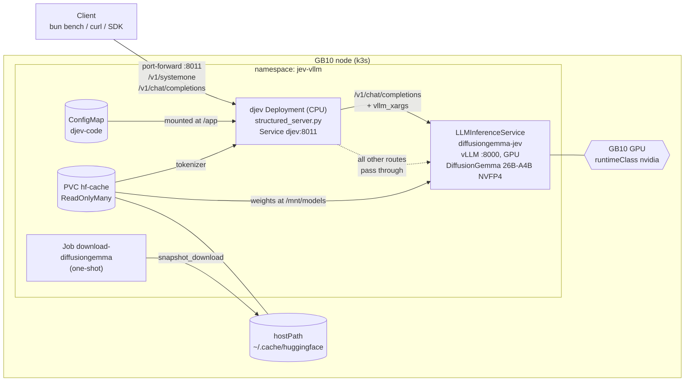
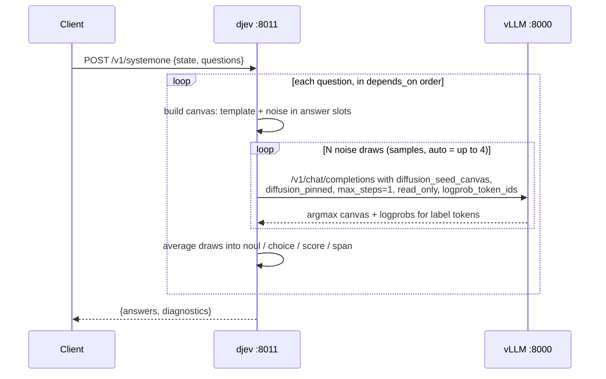

# Jev-vllm

Self-hosted structured decisions on Kubernetes: DiffusionGemma-26B-A4B with
Jev-style structured reads, served by vLLM through KServe `LLMInferenceService`,
with the [djev](https://github.com/mmastrac/djev) decision server in front. Ask
typed questions about a JSON state (yes/no, choice, score, span) and get
probabilities back in ~80–210 ms instead of text to parse.

Built and measured on a single NVIDIA GB10 (DGX Spark) running k3s. Other
Blackwell clusters work with small changes; see
[Adapting to other clusters](#adapting-to-other-clusters).

"Jev" is TypeSafe AI's proprietary System One decision model. This is an open
reimplementation of the same wire API (`/v1/systemone`) on Google's DiffusionGemma,
not Jev itself. The model, hosting and answer quality are different; see
[Compared with real Jev](#compared-with-real-jev).

## Architecture


One inference step, animated: djev sends the seeded canvas, the GPU runs a single
denoise step on the answer slot, and the label-token probabilities flow back.


Kubernetes layout:



A single structured read:



djev does no inference. For each question it builds an answer template, sends
vLLM a normal `/v1/chat/completions` call with `vllm_xargs` fields, and turns the
returned logprobs into `noul` / `choice` / `score` / `span` answers, averaged over a
few noise draws. Anything that is not a structured read passes through to vLLM.

| `vllm_xargs` field | Role |
|---|---|
| `diffusion_seed_canvas` | initial canvas: template text plus noise in the answer slots |
| `diffusion_pinned` | positions held fixed on every step |
| `diffusion_max_steps` | denoise steps before stopping (1 for a plain read) |
| `diffusion_read_only` | return argmax canvas and logprobs at the cap, end the request |
| `logprob_token_ids` | return probabilities for just these token ids (cap 128) |

| vLLM flag | Why |
|---|---|
| `--diffusion-config '{"canvas_length": 64}'` | canvas width; must equal djev `--canvas` |
| `--max-logprobs 32` | allows djev's logprob requests |
| `--enable-prefix-caching` | schema and state prefix is shared across noise draws |
| `--async-scheduling` | needed for canvas widths below the served width |
| `--attention-backend TRITON_ATTN` | from the PR's serve example |

## Why this image

vLLM PR [#57250](https://github.com/vllm-project/vllm/pull/57250) (DiffusionGemma
structured generation) merged 2026-09-22, the same day v0.30.0 shipped, and
v0.30.0's release notes don't mention it. The manifests pin a multi-arch nightly
built from commit `7f1a539`, which is 77 commits past the merge. Switch to a
release tag once one after v0.30.0 exists.

Model: `nvidia/diffusiongemma-26B-A4B-it-NVFP4` (ungated, 18.9 GB, Blackwell NVFP4).
Serve flags are taken from the PR description.

## Layout

| File | Purpose |
|------|---------|
| `k8s/00-namespace.yaml` | `jev-vllm` namespace |
| `scripts/deploy.ts` | one-command deploy: download, fill in the cache path, apply |
| `k8s/05-download-job.yaml` | one-shot model download (pinned revision) into the host cache |
| `k8s/10-model-cache.yaml` | hostPath PV + PVC over that cache |
| `k8s/20-llmisvc-diffusiongemma.yaml` | the vLLM `LLMInferenceService` (GPU) |
| `k8s/30-djev.yaml` | djev Deployment + Service `djev:8011` (CPU only) |
| `djev/` | vendored `structured_server.py` (commit `e5841cf`, Apache-2.0) + LICENSE, shipped as the `djev-code` ConfigMap |
| `client/smoke.ts` | bun chat-completion smoke test (talks to vLLM directly) |
| `client/bench.ts` | bun latency and throughput bench for `/v1/systemone` |
| `client/payloads/` | example request bodies, one per question type |
| `docs/arch.svg`, `docs/inference.svg` | README diagrams (the inference one is animated SMIL) |
| `docs/social/` | PNG / MP4 / GIF renders of the diagrams for LinkedIn and other non-SVG sites |
| `tools/diagrams/render.ts` | rebuilds `docs/social/` from the SVGs |

### Rebuilding the diagram renders

The SVGs are the source; `docs/social/` is generated from them (1920×1080, dark
and light). The script inlines the SVG theme colors, steps the animation frame by
frame, rasterizes with resvg and encodes with ffmpeg (system ffmpeg, `$FFMPEG`,
or the bundled binary).

```bash
cd tools/diagrams && bun install
bun render.ts                 # both themes
bun render.ts --theme dark    # one theme
```

For LinkedIn, post `inference-*.mp4` as a video (uploaded GIFs don't always
animate there) and `architecture-*.png` as an image.

## Requirements

| Need | Notes |
|---|---|
| Kubernetes with a Blackwell GPU node | NVFP4 weights need Blackwell (GB10, B200, RTX 50xx / PRO 6000, ...). Tested on k3s, single node |
| NVIDIA container runtime | a `RuntimeClass` named `nvidia` (k3s and the GPU Operator both provide it) |
| [KServe](https://kserve.github.io/website/) with `LLMInferenceService` | the `serving.kserve.io/v1alpha2` CRD |
| ~20 GB disk on the node, GPU memory for 19 GB of weights plus KV cache | model cache is a `hostPath`; on the GB10 vLLM takes half of its 128 GB unified memory (only tested there) |
| [bun](https://bun.sh) | runs the deploy script and the clients |

## Quick start

Run on the GPU node (the model cache is a `hostPath`, so the download job and the
pods share the node). The script creates the cache directory, downloads the model
as the directory's owner, and applies everything:

```bash
git clone https://github.com/umianta/jev-vllm && cd jev-vllm
bun scripts/deploy.ts                                   # uses kubectl, ~/.cache/huggingface
bun scripts/deploy.ts --kubectl "sudo k3s kubectl"      # k3s without a kubeconfig
bun scripts/deploy.ts --hf-cache /data/hf               # another cache directory
bun scripts/deploy.ts --dry-run                         # print the manifests only
```

Then, once the vLLM pod is ready:

```bash
kubectl -n jev-vllm port-forward svc/djev 8011:8011
curl -s localhost:8011/v1/systemone -H 'content-type: application/json' \
  -d @client/payloads/1-choice.json
```

On a single-GPU node, scale down any other GPU pod first. The first start pulls a
~9.7 GB image and loads weights, so allow several minutes (the startup probe waits
up to 40 min).

The manifests alone also work with `kubectl apply -k .`, using the default cache
path `/var/lib/jev-vllm/hf-cache` (create it and run `k8s/05-download-job.yaml`
first). The script only fills in the path and the uid/gid.

## Adapting to other clusters

The defaults target one GB10 with unified memory. What to change elsewhere:

| Setting | Where | GB10 default | Discrete-GPU cluster |
|---|---|---|---|
| GPU request | `20-llmisvc-diffusiongemma.yaml` | none, `runtimeClassName: nvidia` sees all GPUs | add `resources.limits: {nvidia.com/gpu: 1}` if the NVIDIA device plugin runs |
| `--gpu-memory-utilization` | same | `0.5` (memory is shared with the CPU) | `0.9` on a dedicated card |
| `resources.limits.memory` | same | `100Gi` | host RAM only; `32Gi` is plenty |
| Model cache | `--hf-cache` | `~/.cache/huggingface` | any node path; pin pods to that node with a `nodeSelector`, or swap the PV for shared storage |
| Canvas width | `--diffusion-config` and djev `--canvas` | `64` | must stay equal in both files |

The image is multi-arch (arm64 and amd64). To change `canvas_length`, set it in
`20-llmisvc-diffusiongemma.yaml` and in the djev `--canvas` arg in `30-djev.yaml`,
scale the LLMInferenceService to 0, wait for the pod to go, then apply.

## Use

djev has no authentication by default (set `API_KEY` in its environment to require
a bearer token). Keep it on `localhost` unless you need the LAN.

```bash
kubectl -n jev-vllm port-forward svc/djev 8011:8011                   # localhost only
kubectl -n jev-vllm port-forward --address 0.0.0.0 svc/djev 8011:8011   # whole LAN
```

`POST http://localhost:8011/v1/systemone`, header `Content-Type: application/json`:

```json
{
  "model": "diffusiongemma",
  "state": {"ticket": "Everything is down and we have a demo at noon."},
  "questions": {
    "urgent": {"type": "noul", "instructions": "Does the customer need a reply within the hour?"}
  }
}
```

Response: `{"answers": {"urgent": {"type": "noul", "noul": 0.95}}, "diagnostics": {...}}`.

`model` must be the served name (`diffusiongemma`). The aliases `jev-latest` and
`jev-preview` exist only in OpenJev's own hosted setup.

### Question types

| Type | `criteria` | Answer |
|---|---|---|
| `noul` (yes/no) | optional `{"true": "...", "false": "..."}` | `{"noul": p}` |
| `choice` | `{"option": "description", ...}` | `{"choice", "probabilities", "confidence"}` |
| `score` | ordered list of levels | `{"score", "legend", "probabilities", "confidence"}`; `score` is the probability-weighted level index |
| `span` | optional `{"max_tokens": n}` | `{"found", "text", "start", "end", "confidence", "coverage"}` |
| `spans` | optional `{"max_tokens", "max_items"}` | `{"found", "items": [...]}` |

Optional per question: `depends_on: [ids]` (answered after them, with their answers in
the prompt), `ask_if: {id: [answers]}` (otherwise `null`), `alone: true`. Optional in
the body: `samples` (`"auto"` or N), `steps`, `think` (N thought tokens before the
read), `images`. Each choice option and score level must be a single token in the
tokenizer, so use short plain words.

Structured `/v1/chat/completions` on the same port takes the schema as a JSON system
message (with an `options` list instead of `criteria`) and the state JSON as the user
message. Other routes pass through to vLLM; `/v1/raw/chat/completions` forces
pass-through.

### Example payloads

`client/payloads/` holds seven requests that were run against this deployment:

| File | Shows |
|---|---|
| `1-choice.json` | `choice` with option descriptions |
| `2-score.json` | `score` over ordered levels |
| `3-multi-depends.json` | several questions, `depends_on`, and a `span` |
| `4-ask-if.json` | conditional question with `ask_if` |
| `5-noul-criteria-think.json` | `noul` with `criteria` and `think: 128` |
| `6-chat.json` | structured `/v1/chat/completions` form |
| `7-spans-dates.json` | `spans` returning every date in a text |

```bash
curl -s localhost:8011/v1/systemone -H 'content-type: application/json' \
  -d @client/payloads/1-choice.json
# 6-chat.json goes to /v1/chat/completions instead
```

### Smoke test and bench

```bash
bun client/smoke.ts "Is the sky blue? Answer yes or no."   # needs port-forward to vLLM :8000
bun client/bench.ts                                          # DJEV_URL overrides the base URL
```

## Performance

Measured on an NVIDIA GB10 (DGX Spark, k3s) through `kubectl port-forward`, one `noul` question per request,
canvas 64:

| Mode | Concurrency | p50 | p95 | Throughput |
|---|---|---|---|---|
| default (auto samples, up to 4 draws) | 1 | 210 ms | 262 ms | ~5 decisions/s |
| `"samples": 1` | 1 | 79 ms | 99 ms | ~13 decisions/s |
| default | 8 | 475 ms | 500 ms | 17 decisions/s |
| `"samples": 1` | 8 | 176 ms | 198 ms | 45 decisions/s |
| `"samples": 1` | 32 | 337 ms | 375 ms | 94 decisions/s |

The first calls after a start take about 10 s. A request with four questions plus a
span took about 500 ms. Add `"samples": 1` for lowest latency, at the cost of
less stable probabilities.

## Compared with real Jev

| | Real Jev (TypeSafe AI) | This deployment |
|---|---|---|
| Model | proprietary | Google DiffusionGemma 26B-A4B, NVFP4 (Apache-2.0) |
| Hosting | closed, hosted | self-hosted on your own GPU |
| API | `/v1/systemone` | same endpoint and answer shapes, plus `span`/`spans`, `think`, `samples`, images |
| Speed | claimed "tens of ms" (not measured here) | ~80 ms with one draw, ~210 ms default |
| Quality | theirs | DiffusionGemma's, not evaluated on your tasks |

The OpenJev project says TypeSafe's SDKs work unchanged against its server. That has
not been tested against this deployment.

## Compared with an ordinary LLM

For one yes/no question: the read takes ~80–210 ms; asking the same diffusion model in
plain chat took ~1.0 s median (0.35–1.9 s) and returns text like `thought\nYes`; an
autoregressive Gemma-4-26B FP8 is estimated at ~0.4 s from earlier benchmarks on
the same machine (0.24 s first token, 73 ms per token at 16 concurrent
requests). That last figure is derived, not measured on this task. The read returns a
probability with a spread across noise draws instead of text to parse, and answers
several questions in one pass. Accuracy has not been compared on a labeled set.

## Gotchas

- **Dangling model symlinks.** The `huggingface_hub` in the image stores real files at
  `hub/blobs/<xx>/<sha>` and links to them from `models--*/blobs/`, one level above
  the model directory the pod mounts. vLLM then fails with `FileNotFoundError` on the
  safetensors. The download job replaces those links with hardlinks; if you download
  the model some other way, do the same (`ln -f "$(readlink -f f)" f.tmp && mv -f f.tmp f`).
- **Model revision is pinned.** The manifests load `snapshots/ec4ff3df...`, and the
  download job fetches exactly that revision. To move to a newer one, change the hash
  in all three files (`05`, `20`, `30`).
- **Memory-profiling assertion on restart.** If a previous vLLM pod is still
  releasing unified memory, the new pod can die with `Error in memory profiling`.
  It starts cleanly on the next restart; scale to 0 and wait a few seconds before
  scaling back to 1 to avoid it.
- **Unsupported sampling parameters.** vLLM rejects `temperature`, `min_p`, `seed`,
  `min_tokens`, `logit_bias`, `bad_words` and `allowed_token_ids` on diffusion models
  with HTTP 400. Plain chat output starts with a `thought` channel prefix.
- **Port-forward resets keep-alive connections.** `kubectl port-forward` can drop a
  reused socket (`ECONNRESET`). Send `Connection: close` or run the client in-cluster.
- **Port 8011 already in use.** A leftover `kubectl port-forward` holds it. Find it with
  `sudo ss -ltnp 'sport = :8011'` and kill that PID.
- **Off by default.** djev `--constrained` and `--engine-samples` need unmerged vLLM PRs
  (#58216, #58438).

## Tear down

```bash
kubectl delete -k .   # the PV is Retain; the model files stay in the HF cache
```

## License

Apache-2.0, see [LICENSE](LICENSE). `djev/structured_server.py` is vendored from
[mmastrac/djev](https://github.com/mmastrac/djev) under its own Apache-2.0
[license](djev/LICENSE). The model weights are covered by their own license on
Hugging Face.
