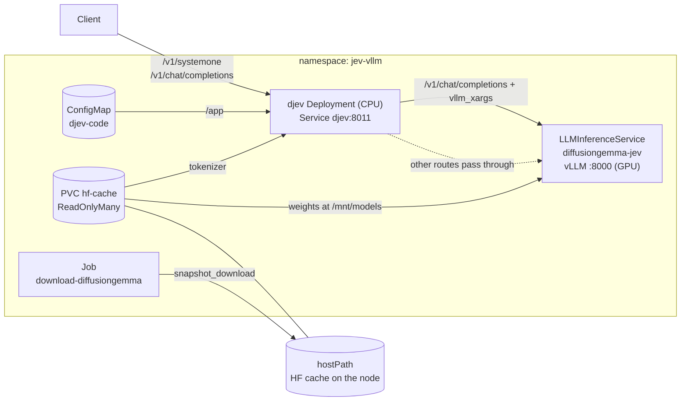

# jev-vllm

Self-hosted structured decisions on Kubernetes. Ask typed questions about a JSON
state (yes/no, choice, score, span) and get probabilities back in
~80–210 ms, with no text to parse.

It runs Google's **DiffusionGemma 26B-A4B (NVFP4)** on **vLLM** through **KServe
`LLMInferenceService`**, with the [djev](https://github.com/mmastrac/djev) decision
server in front exposing a Jev-compatible `/v1/systemone` API.

> This is an open reimplementation of the `/v1/systemone` wire API from TypeSafe
> AI's proprietary Jev model. It is not Jev and is not affiliated with TypeSafe AI;
> the model and answer quality differ.

```jsonc
// POST /v1/systemone
{
  "model": "diffusiongemma",
  "state": { "ticket": "Everything is down and we have a demo at noon." },
  "questions": {
    "urgent": { "type": "noul", "instructions": "Does the customer need a reply within the hour?" }
  }
}

// 200 OK
{ "answers": { "urgent": { "type": "noul", "noul": 0.95 } }, "diagnostics": { ... } }
```

## Architecture


djev does no inference itself. It builds a canvas (the prompt template plus noise
in the answer slots) and asks vLLM for a **single denoise step**. vLLM returns log-probabilities for just the label tokens, and djev turns
them into answers, averaging over a few noise draws:


<details>
<summary>Kubernetes resources</summary>



</details>

## Quick start

### Requirements

- Kubernetes with a **Blackwell** GPU node (NVFP4 needs Blackwell: GB10, B200,
  RTX 50xx / PRO 6000). Developed and tested on a single NVIDIA GB10 (DGX Spark)
  running k3s.
- NVIDIA container runtime, exposed as a `RuntimeClass` named `nvidia` (k3s and the
  GPU Operator both provide it).
- [KServe](https://kserve.github.io/website/) with the `LLMInferenceService` CRD
  (`serving.kserve.io/v1alpha2`).
- ~20 GB of disk on the node and enough GPU memory for 19 GB of weights plus KV cache.
- [bun](https://bun.sh) for the deploy script and clients.

### Deploy

Run on the GPU node. The model cache is a `hostPath`, so the download job and the
pods need the same node.

```bash
git clone https://github.com/umianta/jev-vllm && cd jev-vllm
bun scripts/deploy.ts
```

The script creates the cache directory, downloads the model as that directory's
owner, fills in the cache path and applies the kustomization. Options:

| Flag | Default | |
|---|---|---|
| `--kubectl` | `$KUBECTL` or `kubectl` | e.g. `"sudo k3s kubectl"` |
| `--hf-cache` | `~/.cache/huggingface` | cache directory on the node |
| `--uid`, `--gid` | owner of `--hf-cache` | user the download job runs as |
| `--skip-download` | off | apply only |
| `--dry-run` | off | print the manifests, apply nothing |

The first start pulls a ~9.7 GB image and loads the weights, which takes several
minutes (the startup probe allows 40). On a single-GPU node, scale down any other
GPU workload first.

Without the script, `kubectl apply -k .` works with the default cache path
`/var/lib/jev-vllm/hf-cache`; create it and run `k8s/05-download-job.yaml` first.

### First request

```bash
kubectl -n jev-vllm port-forward svc/djev 8011:8011
curl -s localhost:8011/v1/systemone -H 'content-type: application/json' \
  -d @client/payloads/1-choice.json
```

djev has no authentication unless `API_KEY` is set in its environment (it then
requires `Authorization: Bearer <key>`). Keep the port-forward on localhost, or add
`--address 0.0.0.0` to expose it on your LAN.

## API

`POST /v1/systemone` takes a `state` object and a map of named `questions`.
`model` must be the served name, `diffusiongemma`.

| Type | `criteria` | Answer |
|---|---|---|
| `noul` (yes/no) | optional `{"true": "...", "false": "..."}` | `{"noul": p}` |
| `choice` | `{"option": "description", ...}` | `{"choice", "probabilities", "confidence"}` |
| `score` | ordered list of levels | `{"score", "legend", "probabilities", "confidence"}`; `score` is the probability-weighted level index |
| `span` | optional `{"max_tokens": n}` | `{"found", "text", "start", "end", "confidence", "coverage"}` |
| `spans` | optional `{"max_tokens", "max_items"}` | `{"found", "items": [...]}` |

Choice options and score levels must each be a single token in the tokenizer, so
use short plain words.

| Option | Scope | Effect |
|---|---|---|
| `depends_on: [ids]` | question | answered after those questions, with their answers in the prompt |
| `ask_if: {id: [answers]}` | question | asked only when the condition holds, otherwise `null` |
| `alone: true` | question | gets a read of its own instead of sharing one |
| `samples` | request | noise draws per question, `"auto"` (up to 4) or N |
| `steps` | request | denoise steps per read, 1–8 (default 1) |
| `think` | request | N thought tokens before the read |
| `images` | request | image inputs as data URLs |

The same port also serves a **structured `/v1/chat/completions`**: the schema as a
JSON system message (with `options` instead of `criteria`) and the state JSON as the
user message. All other routes pass through to vLLM; `/v1/raw/chat/completions`
forces pass-through.

[`client/payloads/`](client/payloads) has a working request for each feature:

| File | Shows |
|---|---|
| `1-choice.json` | `choice` with option descriptions |
| `2-score.json` | `score` over ordered levels |
| `3-multi-depends.json` | several questions, `depends_on` and a `span` |
| `4-ask-if.json` | conditional question with `ask_if` |
| `5-noul-criteria-think.json` | `noul` with `criteria` and `think: 128` |
| `6-chat.json` | structured `/v1/chat/completions` (post it there) |
| `7-spans-dates.json` | `spans` returning every date in a text |

## How it works

djev sends vLLM an ordinary `/v1/chat/completions` request with these `vllm_xargs`
fields, added by vLLM PR [#57250](https://github.com/vllm-project/vllm/pull/57250):

| `vllm_xargs` field | Role |
|---|---|
| `diffusion_seed_canvas` | initial canvas: template text plus noise in the answer slots |
| `diffusion_pinned` | positions held fixed on every step |
| `diffusion_max_steps` | denoise steps before stopping (1 for a plain read) |
| `diffusion_read_only` | return the argmax canvas and logprobs at the cap, then end the request |
| `logprob_token_ids` | return probabilities for just these token ids (max 128) |

Questions run in stages by their dependencies. Each stage is one joint read over
all its questions (chunked to the canvas width), and later stages see earlier
answers. Noise draws share the schema and state prefix, which vLLM's prefix cache
reuses.

## Configuration

**Image.** PR #57250 merged on 2026-09-22, but v0.30.0 (released the same day)
does not include it. The manifests pin the multi-arch nightly
`vllm/vllm-openai:nightly-7f1a539…`, built 77 commits after the merge. Move to a
release tag once one after v0.30.0 ships.

**Model.** [`nvidia/diffusiongemma-26B-A4B-it-NVFP4`](https://huggingface.co/nvidia/diffusiongemma-26B-A4B-it-NVFP4)
(ungated, 18.9 GB), pinned to revision `ec4ff3df…`. To upgrade, change the hash in
`k8s/05`, `20` and `30`.

**vLLM flags** (in `k8s/20-llmisvc-diffusiongemma.yaml`):

| Flag | Why |
|---|---|
| `--diffusion-config '{"canvas_length": 64}'` | canvas width; must equal djev `--canvas` in `k8s/30-djev.yaml` |
| `--max-logprobs 32` | allows djev's logprob requests |
| `--enable-prefix-caching` | reuses the shared schema/state prefix across draws |
| `--async-scheduling` | required for canvas widths below the served width |
| `--attention-backend TRITON_ATTN` | from the PR's serve example |

To change the canvas width, update both files, scale the `LLMInferenceService` to
0, wait for the pod to exit, then apply.

**Other clusters.** The defaults target one GB10 with unified memory. For
discrete-GPU clusters:

| Setting | GB10 default | Discrete GPU |
|---|---|---|
| GPU request | none; `runtimeClassName: nvidia` sees all GPUs | add `resources.limits: {nvidia.com/gpu: 1}` with the NVIDIA device plugin |
| `--gpu-memory-utilization` | `0.5` (memory shared with the CPU) | `0.9` on a dedicated card |
| `resources.limits.memory` | `100Gi` | host RAM only; `32Gi` is plenty |
| Model cache | `hostPath` on the node | pin pods with a `nodeSelector`, or replace the PV with shared storage |

These discrete-GPU values are untested starting points.

## Performance

One `noul` question per request, canvas 64, on an NVIDIA GB10 through
`kubectl port-forward`:

| Mode | Concurrency | p50 | p95 | Throughput |
|---|---|---|---|---|
| default (`samples: "auto"`, up to 4 draws) | 1 | 210 ms | 262 ms | ~5 decisions/s |
| `samples: 1` | 1 | 79 ms | 99 ms | ~13 decisions/s |
| default | 8 | 475 ms | 500 ms | 17 decisions/s |
| `samples: 1` | 8 | 176 ms | 198 ms | 45 decisions/s |
| `samples: 1` | 32 | 337 ms | 375 ms | 94 decisions/s |

A request with four questions plus a span takes ~500 ms, and the first calls after
a start take ~10 s. `samples: 1` gives the lowest latency with less stable
probabilities.

For comparison, asking the same model the yes/no question in plain chat took
~1.0 s median (0.35–1.9 s) and returned text like `thought\nYes`. Accuracy has not
been evaluated on a labeled set.

## Troubleshooting

| Symptom | Cause and fix |
|---|---|
| vLLM `FileNotFoundError` on the safetensors | The image's `huggingface_hub` leaves symlinks in the model's `blobs/` pointing outside the mounted directory. The download job replaces them with hardlinks; if you downloaded the model another way, do the same: `ln -f "$(readlink -f f)" f.tmp && mv -f f.tmp f`. |
| `Error in memory profiling` after a restart | The previous vLLM pod was still releasing unified memory. Scale to 0, wait a few seconds, scale back to 1. |
| HTTP 400 on chat requests | Diffusion models reject `temperature`, `min_p`, `seed`, `min_tokens`, `logit_bias`, `bad_words` and `allowed_token_ids`. Plain chat output also starts with a `thought` prefix. |
| `ECONNRESET` on reused connections | `kubectl port-forward` drops keep-alive sockets. Send `Connection: close` or run the client in-cluster. |
| Port 8011 already in use | A leftover port-forward holds it: `sudo ss -ltnp 'sport = :8011'`, then kill that PID. |

djev's `--constrained` and `--engine-samples` modes are off because they need
unmerged vLLM PRs (#58216, #58438).

## Development

```bash
bun client/smoke.ts "Is the sky blue? Answer yes or no."   # plain chat against vLLM :8000 (port-forward it)
bun client/bench.ts                                         # latency/throughput; DJEV_URL overrides the base URL
```

| Path | Contents |
|---|---|
| `scripts/deploy.ts` | one-command deploy |
| `k8s/` | namespace, download Job, cache PV/PVC, `LLMInferenceService`, djev Deployment + Service |
| `djev/` | vendored `structured_server.py` ([mmastrac/djev](https://github.com/mmastrac/djev) @ `e5841cf`), shipped as the `djev-code` ConfigMap |
| `client/` | bun smoke test, benchmark and example payloads |
| `docs/` | README diagrams (SVG) and `social/` PNG/MP4/GIF renders |
| `tools/diagrams/` | rebuilds `docs/social/` from the SVGs: `bun install && bun render.ts` |

**Uninstall:** `kubectl delete -k .` The PV uses `Retain`, so the model files stay
in the cache directory.

## License

Apache-2.0; see [LICENSE](LICENSE). `djev/structured_server.py` is vendored from
[mmastrac/djev](https://github.com/mmastrac/djev) under its own
[Apache-2.0 license](djev/LICENSE). Model weights are covered by their license on
Hugging Face.
