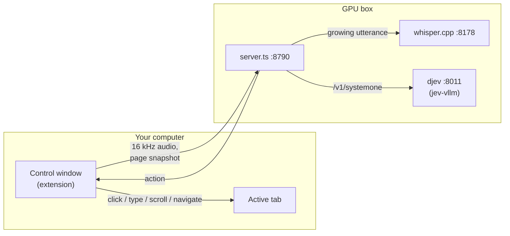
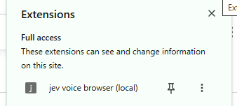

# voice-browser (local)

**Talk to your browser. It acts, often before you finish the sentence, and nothing
leaves your hardware.** Speech-to-text runs on your GPU with whisper.cpp, and every
decision is a `/v1/systemone` call to your own [jev-vllm](../../README.md) deployment.

A self-hosted take on [jev-voice-browser](https://github.com/moritzkremb/jev-voice-browser)
by Moritz Kremb, which uses the hosted Jev API and Chrome's Web Speech API (audio
goes to Google). This version adapts its question design and thresholds, and swaps
both services for local ones.


*A real session in Chrome: every spoken command, what it did, and how long the
decision took. The last one, "Stop.", was correctly ignored.*

| | Measured on one NVIDIA GB10 |
|---|---|
| Speech-to-text (whisper.cpp `small.en`, CUDA) | 33–100 ms per partial transcript |
| Decision (9–10 typed questions, one read) | ~130 ms p50, ~140 ms p95 |
| Spoken-command eval | 37 / 38 (a borderline case occasionally flips to 36) |
| Cost per decision | none beyond your GPU |

## How it works



1. The extension's control window streams your microphone (16 kHz PCM) over a
   WebSocket, along with a snapshot of the active tab: up to 26 visible links,
   buttons and fields, labelled `a`–`z`.
2. The server detects speech, and while you talk it re-transcribes the growing
   utterance every 300 ms.
3. Each new partial transcript goes to djev as **one request with 9–10 typed
   questions**, answered in a single ~130 ms read:

   | Question | Type | Used for |
   |---|---|---|
   | `is_command` | yes/no | ignore speech not meant for the browser |
   | `complete` | yes/no | act mid-sentence only when nothing is missing |
   | `intent` | choice of 12 | open, search, click, type, scroll, back, forward, reload, tab, close, switch, none |
   | `target` | choice of the page's `a`–`z` | which element to click or type into |
   | `destructive` | yes/no | require a spoken "confirm" before buy, delete, send, submit |
   | `scroll_dir`, `scroll_amount` | choice, score | up/down; little, page or to the end |
   | `tab_which` | choice | next, previous, first or last tab |
   | `is_correction` | yes/no | recorded for context |

4. [`src/policy.ts`](src/policy.ts) turns the probabilities into **act, wait,
   confirm, disambiguate or ignore**. A confident, complete command acts at once,
   usually while you are still talking; search and typed text wait for a pause,
   since the words are still arriving. Each utterance acts at most once.
5. Words that must be copied exactly (site names, search terms, text to type) are
   extracted by rules in [`src/spans.ts`](src/spans.ts) rather than by model span
   questions: that was ~15× faster (140 ms vs ~2 s) and more exact.
6. The extension carries out the action in your real browser: navigation through
   the `chrome.tabs` API, clicks and typing through an injected script, with a
   highlight on the element acted on.

## Setup

You need a running [jev-vllm](../../README.md#quick-start) deployment, and
[bun](https://bun.sh), `cmake` and a C++ compiler on the GPU box (CUDA optional).

**On the GPU box:**

```bash
cd examples/voice-browser
bun install

# 1. Local speech-to-text: builds whisper.cpp (CUDA if nvcc is found) and fetches small.en
bun run setup:whisper
~/.cache/jev-voice/whisper.cpp/build/bin/whisper-server \
  -m ~/.cache/jev-voice/whisper.cpp/models/ggml-small.en.bin --host 127.0.0.1 --port 8178 -nt &

# 2. djev reachable on localhost:8011 ...
kubectl -n jev-vllm port-forward svc/djev 8011:8011 &
#    ... or skip the port-forward on the k3s node and use the service address:
#    export DJEV_URL=http://$(kubectl -n jev-vllm get svc djev -o jsonpath='{.spec.clusterIP}'):8011

# 3. The voice-browser server (127.0.0.1:8790)
bun run server
```

**On the computer with your browser and microphone:**

1. Forward port 8790 from the GPU box, e.g. `ssh -L 8790:localhost:8790 gpu-box`
   (VS Code Remote forwards it automatically). On a single machine, skip this.
2. Build the extension (`bun run build`, on either machine) and copy
   `extension/` over if you built it remotely.
3. In Chrome or Edge, open `chrome://extensions`, turn on **Developer mode**, click
   **Load unpacked** and pick the `extension/` folder.
   It then appears under the toolbar's Extensions menu with access to the sites
   you visit, which it needs to read and click the page:

   

4. Click the extension's toolbar button. In the control window, press **Start
   listening** and allow the microphone.
5. Switch to a normal tab and talk: "open wikipedia", "search for the enigma
   machine", "click the Turing machine link", "scroll down", "go back".

| Setting | Default | |
|---|---|---|
| `DJEV_URL` | `http://localhost:8011` | jev-vllm's djev service |
| `WHISPER_URL` | `http://127.0.0.1:8178` | whisper.cpp server |
| `PORT`, `HOST` | `8790`, `127.0.0.1` | keep it on localhost: whoever connects can drive your browser |
| `SAMPLES` | `1` | noise draws per decision; `auto` averaged up to 4, ~3× slower, no accuracy gain on the eval |
| `--model` (setup) | `small.en` | `base.en` is faster, `large-v3-turbo` more accurate |

## Tests and eval

```bash
bun test test/                                 # 49 unit tests: spans, policy, VAD, session loop, injected page scripts
DJEV_URL=http://localhost:8011 bun run eval    # 38 spoken commands against the live model
bun run typecheck
```

The eval ([`eval/cases.ts`](eval/cases.ts)) covers open, search, click by
description, type, scroll, navigation, tabs, confirmation of destructive actions,
non-commands and mid-sentence behaviour. Current result: **37/38**; the decision
uses one noise draw, so a borderline case occasionally flips and a run scores 36/38.

## Known limitations

- **One eval case clicks the wrong element.** "open the starship launch" on the
  YouTube fixture clicks *Home* (target `a`, ~0.6–0.75) instead of the Starship
  video. "click the starship launch" and "play the starship video" pick it at
  ~0.9. Rewording the intent descriptions fixed this case but broke "go to shorts",
  so it is left as a known failure rather than tuned away.
- **Open mic, spoken questions.** Question-like speech ("ask what you can do for
  your country") can be read as a search. Stop listening when you're not talking
  to the browser.
- **26 elements per page.** djev allows at most 26 options per choice, so on busy
  pages only the fields and largest visible elements are listed; scroll to reach
  others.
- **Probabilities are DiffusionGemma's, not calibrated.** The thresholds in
  `src/policy.ts` were set on this eval, not on real usage.
- **Chrome and Edge only**, and not on `chrome://` pages or the Web Store, where
  extensions can't run scripts (navigation still works there).
- **Misheard words.** whisper sometimes mishears the command verb ("such for love
  in magic"). The intent still comes out right, and search extraction drops a
  misheard verb before "for", but other mishearings end up in the search text.
- **Real-browser coverage is small.** The page scripts are unit-tested in happy-dom
  and have been used in Chrome on YouTube, Wikipedia and Google (open, search, and
  typing into Google's search box), not yet across many sites.

## Layout

| Path | Contents |
|---|---|
| `server.ts` | WebSocket server: audio and snapshots in, actions out |
| `src/session.ts` | utterances, partial transcription, debounced decisions, confirm flow |
| `src/questions.ts` | the typed questions and the state they read |
| `src/policy.ts` | thresholds; answers → act / wait / confirm / disambiguate / ignore |
| `src/spans.ts`, `src/sites.ts` | verbatim text extraction; site and search URLs |
| `src/audio.ts`, `src/stt.ts` | voice activity detection, WAV encoding, whisper client |
| `extension/` | Chrome MV3 extension: control window, audio worklet, injected page scripts |
| `eval/` | page fixtures, spoken-command cases, live eval runner |
| `scripts/setup-whisper.ts` | builds whisper.cpp and downloads a model |
